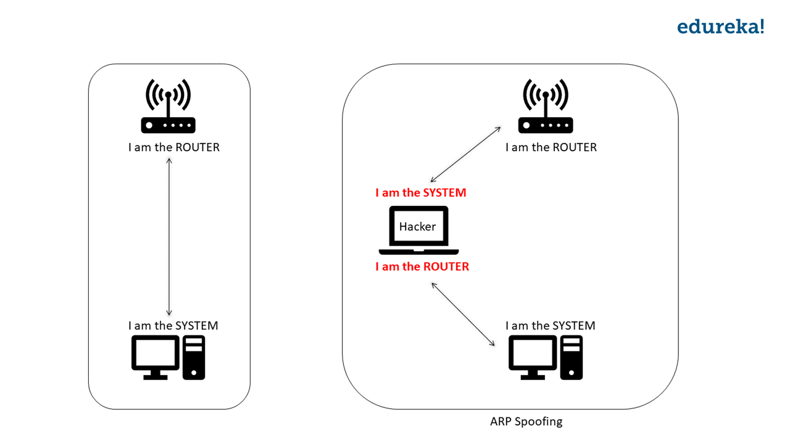

## Kane-cutter
The Netcut program using `Python 3.7` and `Scapy`

Running this program by following steps:

**Step 1** Install the dependencies in `pyproject.toml`

```
poetry install
```

**Step 2** Install latest Npcap in https://nmap.org/npcap/ it work well with version `1.10`

**Step 3** Run `python main.py` and enjoy

## Features

1. Cut everyone in the network
2. Scan the network
3. Set the white list


This program will scan the network which is your local machine connect on
and do the ARP Spoofing attack, you can set the white list wishing to be safe
by this attacking

## Knowledge

ARP Spoofing is the technique of redirecting the network traffic to the hacker
by faking the IP address

In simple terms: When there is a connection between a system and the router 
(basically between two IP addresses), the hacker will fake his/her IP address.
 The hacker will tell 1) The Router that he/she is the system and 2) 
 The System that he/she is the router. Now, the router will send the data to 
 the hacker instead of the system, and the system will send the data to the 
 hacker instead of the router. Hence the network flows through the hacker.



Read more: https://www.edureka.co/blog/python-arp-spoofer-for-ethical-hacking